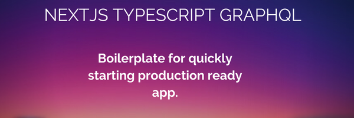

# NextJs Typescript Graphql Boilerplate

Boilerplate for building applications using Next.js with Typescript and Graphql client



This boilerplate is made for those who want to start a new project using typescript, Apollo, Graphql, Redux, etc., which are often used in real-world projects along with Next.js.


## Features
* Authentication via OAuth (Google ..)
* App Theme (Dark and Light)
* Support for i18n
 
## Teck Stack
- [Next.js](https://nextjs.org)
- [UI Component Library](https://chakra-ui.com/)
- [GraphQl Client](https://www.apollographql.com/)
- [NextAuth](https://next-auth.js.org/)
- [TypeScript](https://www.typescriptlang.org/)
- [Emotion](https://emotion.sh/)
- [ESLint](https://eslint.org)
- [Prettier](https://prettier.io)

## Requirements
- [Node.js](https://nodejs.org/)
- [Yarn](https://yarnpkg.com/)

## Installation
1. Clone the repository:

   ```bash
    git clone https://github.com/Pushkar952/Next-typescript-graphql-boilerplate.git
   ```

1. Install dependent packages:

   ```bash
   yarn install
   ```
   
 1. After creating Google OAuth Client from https://console.developers.google.com/apis/credentials/oauthclient, copy `GOOGLE_CLIENT_ID` and `GOOGLE_CLIENT_SECRET` and paste them into `env` file in root folder.


## Development mode commands
1. Run the application in development mode.
    ```bash
    yarn dev
    ```
1. Build production.
    ```bash
    yarn build
    ```
1. Run the application in production mode.
    ```bash
    yarn start
    ```

-   ## Naming Conventions

    -   Folder Name : your-folder-name.
    -   File Name : your-file-name.ts
    -   Component Name : YourComponentName
    -   Variable Name : yourVariableName
    -   Private Variable : \_yourPrivateVariable
    -   Constant Variable Name : CONSTANT_VARIABLE_NAME
    -   Function Name : yourFunctionName()
    -   Private Function Name : \_yourPrivateFunctionName()

-  ## Folder structure

```
nextjs-apollo-boilerplate
├─ .env
├─ .eslintrc
├─ apollo.config.js
├─ i18n.json
├─ public
├─ src
│  ├─ components
│  ├─ lib
│  ├─ pages
│  ├─ redux
│  ├─ services
│  │  ├─ api
│  │  │  └─ apiClient.ts
│  │  └─ graphql
│  │     ├─ apolloClient.ts
│  │     └─ launches.ts
│  ├─ styles
│  │  └─ theme
│  │     ├─ foundations
│  │     │  ├─ colors.ts
│  │     │  ├─ fontSizes.ts
│  │     │  ├─ layerStyles.ts
│  │     │  └─ textStyles.ts
│  │     ├─ index.ts
│  │     └─ styles.ts
│  └─ types
│     ├─ declaration
│     │  ├─ environment.d.ts
│     │  ├─ index.d.ts
│     └─ user.ts
├─ test
│  ├─ index.tsx
│  ├─ jest.config.js
│  └─ jest.setup.ts
```;


## Deployment

You can deploy your application to [Vercel]((https://vercel.com/signup/)) by clicking the button below.

[](https://vercel.com/new/clone?repository-url=https%3A%2F%2Fgithub.com%2Fcaribjin%2Fnextjs-apollo-boilerplate&env=GOOGLE_CLIENT_ID,GOOGLE_CLIENT_SECRET,)


## License

[MIT](https://choosealicense.com/licenses/mit/)


